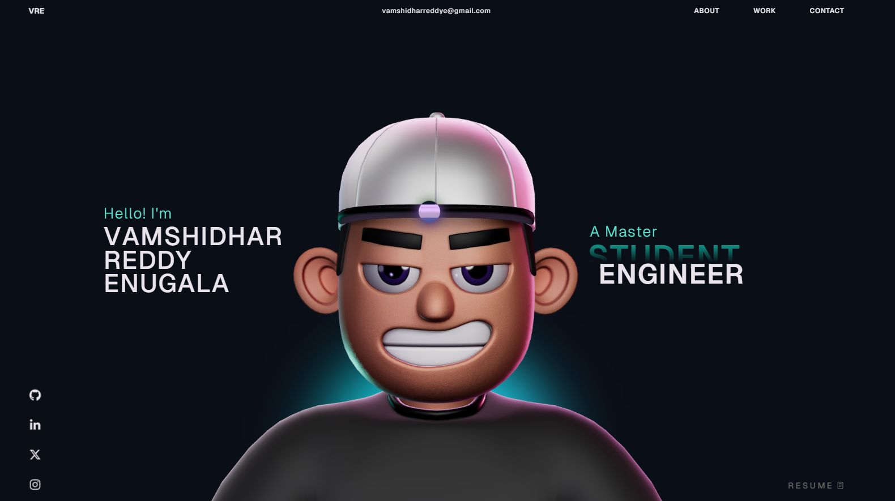

# Vamshidhar Reddy Enugala : Portfolio Website 🚀

A modern, interactive portfolio website built with **React**, **TypeScript**, **Three.js**, and **GSAP** featuring 3D character animations, smooth scroll effects, and a premium design aesthetic.



---

## ✨ Features

- **Interactive 3D Character** — Rendered with React Three Fiber & Drei, featuring physics-based interactions (Cannon / Rapier)
- **Smooth Scroll Animations** — Powered by GSAP ScrollTrigger with split-text reveals and parallax effects
- **Custom Cursor** — A dynamic, context-aware cursor that reacts to hoverable elements
- **Lazy Loading** — Components and 3D models are loaded on demand via React Suspense for fast initial paint
- **Responsive Layout** — Desktop & mobile optimised with adaptive 3D rendering (3D model hidden on smaller screens)
- **Sections** — Landing · About · What I Do · Career · Work · Tech Stack · Contact

---

## 🛠️ Tech Stack

| Category | Technologies |
|---|---|
| **Framework** | React 18, TypeScript |
| **3D / WebGL** | Three.js, React Three Fiber, Drei, Cannon, Rapier, Post-processing |
| **Animation** | GSAP (ScrollTrigger, SplitText) |
| **Build Tool** | Vite 5 |
| **Styling** | Vanilla CSS with custom properties |
| **Analytics** | Vercel Analytics |
| **Other** | React Icons, React Fast Marquee |

---

## 🚀 Getting Started

### Prerequisites

- [Node.js](https://nodejs.org/) (v18+ recommended)
- npm (comes with Node.js)

### Installation

```bash
# Clone the repository
git clone https://github.com/vamshidharre/Vamshidhar_Portfolio.git
cd Vamshidhar_Portfolio

# Install dependencies
npm install
```

### Development

```bash
# Start the dev server (accessible on your local network)
npm run dev
```

The app will be available at **http://localhost:5173** (default Vite port).

### Production Build

```bash
# Type-check & build for production
npm run build

# Preview the production build locally
npm run preview
```

### Linting

```bash
npm run lint
```

---

## 📁 Project Structure

```
Vamshidhar_Portfolio/
├── public/
│   ├── draco/            # Draco decoder for compressed 3D models
│   ├── images/           # Static images & tech-stack logos
│   └── models/           # 3D model files (.glb / .gltf)
├── src/
│   ├── assets/           # Bundled assets
│   ├── components/
│   │   ├── Character/    # 3D character model component
│   │   ├── styles/       # Component-level CSS
│   │   ├── utils/        # Helper utilities (splitText, initialFX, etc.)
│   │   ├── Landing.tsx   # Hero / intro section
│   │   ├── About.tsx     # About me section
│   │   ├── WhatIDo.tsx   # Services / skills overview
│   │   ├── Career.tsx    # Experience timeline
│   │   ├── Work.tsx      # Project showcase
│   │   ├── TechStack.tsx # Technology stack (lazy-loaded)
│   │   ├── Contact.tsx   # Contact & socials
│   │   └── ...           # Navbar, Cursor, SocialIcons, etc.
│   ├── context/          # React context providers
│   ├── data/             # Static data / content
│   ├── App.tsx           # Root component
│   └── main.tsx          # Entry point
├── index.html            # HTML shell
├── vite.config.ts        # Vite configuration
├── tsconfig.json         # TypeScript config
└── package.json
```

---

## ⚠️ GSAP Club Plugins

This project uses **GSAP trial plugins** for development. The trial versions **cannot be used in production deployments**.

To deploy to production, you'll need GSAP Club plugins:
👉 [GSAP Installation & Club Plugins](https://gsap.com/docs/v3/Installation/)

---

## 📬 Contact

- **Email** — [vamshidharreddye@gmail.com](mailto:vamshidharreddye@gmail.com)
- **LinkedIn** — [linkedin.com/in/vamshidhar-reddy-7180551a2](https://www.linkedin.com/in/vamshidhar-reddy-7180551a2/)
- **GitHub** — [github.com/vamshidharre](https://github.com/vamshidharre)

---

## 📄 License

This project is open source and available under the [MIT License](LICENSE).
